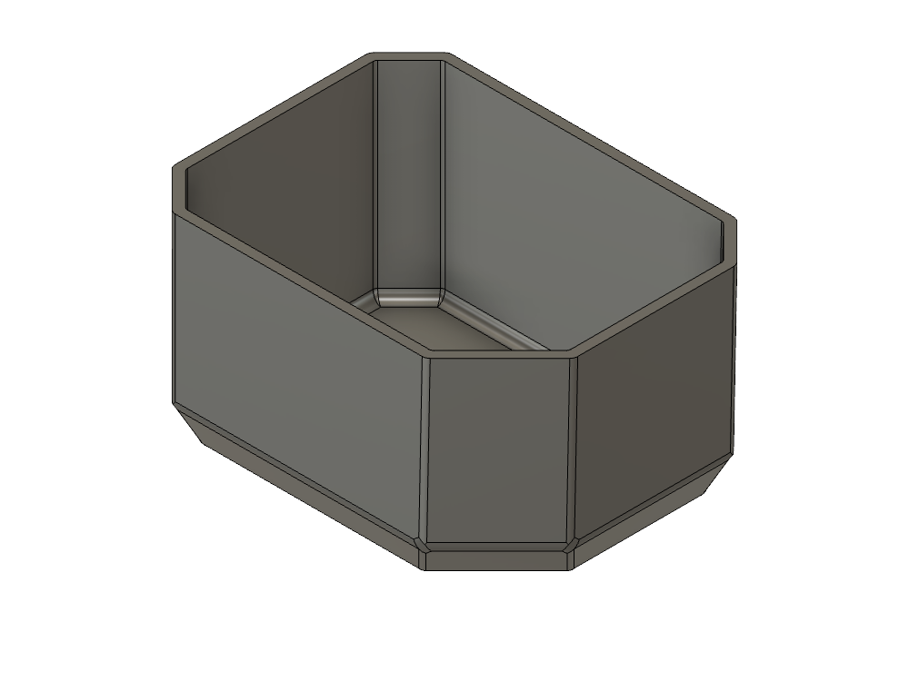
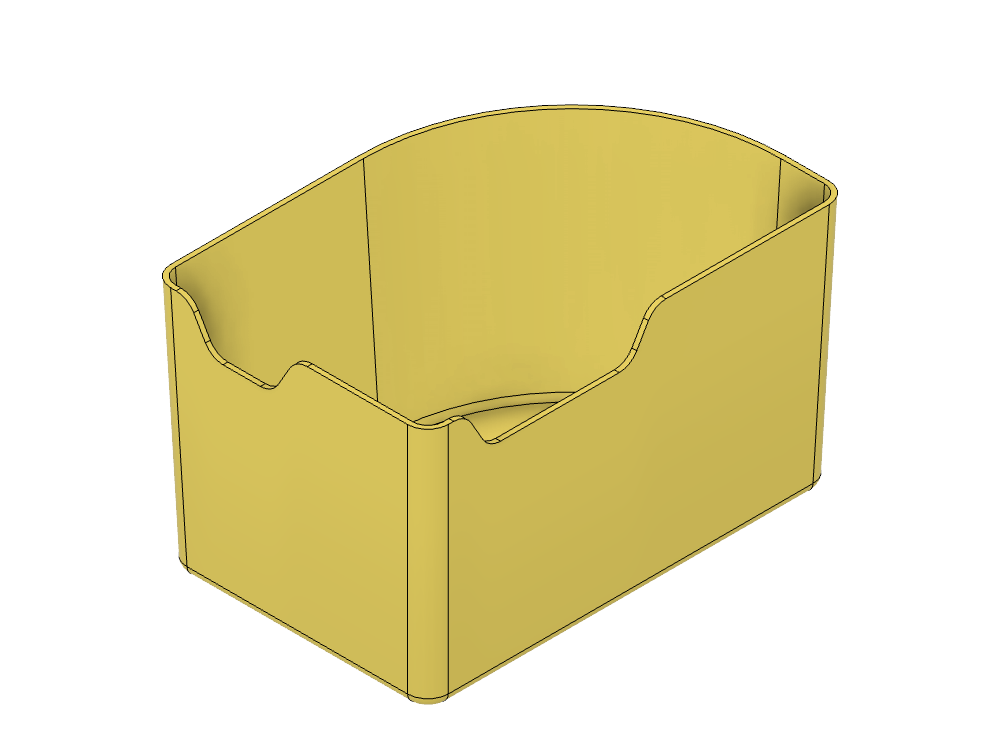
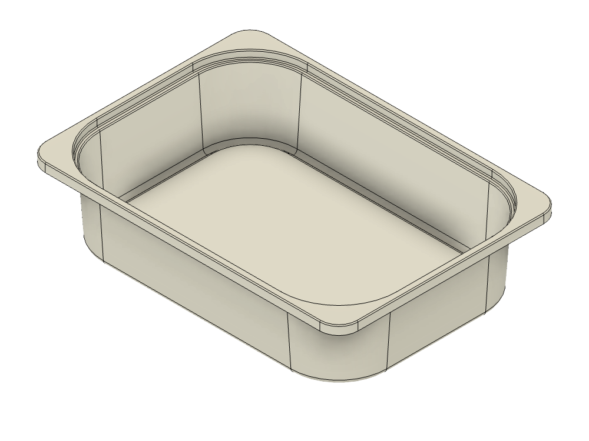

# XYZ FYI

An archive of CAD files, STLs, and other useful downloads.

Everything here is released under [CC0 1.0](License.txt) — public domain, no attribution required. Print it, remix it, sell it, whatever you like.

## Projects

| | Project | Description |
|---|---|---|
|  | [**Packout Inserts**](packout-inserts/) | Inserts that subdivide the bins of a Milwaukee Packout tray organizer |
|  | [**IKEA — LEGO Bins**](trofast-lego-bins/) | Bins and dividers to organize LEGO in IKEA Trofast storage boxes |
|  | [**Alpha Blocks**](alpha-blocks/) | A set of 1 inch alphabet letter blocks |
|  | [**XYZ Block**](xyz-block/) | A visual reference guide, and a handy 1 inch calibration block |
|  | [**Trofast Storage Box**](trofast-storage-box/) | Reference models of IKEA's Trofast storage boxes, for designing things that fit them |

## Layout

Each project folder follows the same shape:

```
project-name/
├── README.md     model table with sizes, fit notes and download links
├── images/       thumbnails (orthographic isometric, transparent background)
├── print/        .stl and .3mf  — ready to slice
└── cad/          .step and .f3d — editable source
```

Filenames are lowercase kebab-case, and every format for a given model shares one basename, so `cad/thing.step` and `print/thing.stl` are always the same part.

## Viewing models

GitHub renders `.stl` files with an interactive viewer — click any STL in this repo and you can drag to spin it, right-drag to pan, and scroll to zoom. No download needed to see what something is.

STL files must be under 10 MB for the viewer to work, so meshes here are exported at a resolution that stays well inside that while remaining accurate to within a few thousandths of a percent by volume.

## Formats

| Format | What it is | Use it for |
|---|---|---|
| **STL** | Binary triangle mesh, millimetres | Slicing, quick preview in GitHub |
| **3MF** | Modern mesh container, units declared in-file | Slicing — preferred where supported |
| **STEP** | Neutral solid, no history | Editing in any CAD package |
| **F3D** | Fusion archive with full feature history | Editing parametrically in Fusion |

All meshes are **watertight** and exported in **millimetres**.

> Some STL files published before July 2026 were exported in inches and imported 25.4× undersized in slicers that assume millimetres. Every file currently in this repo has been re-exported in millimetres and verified.
