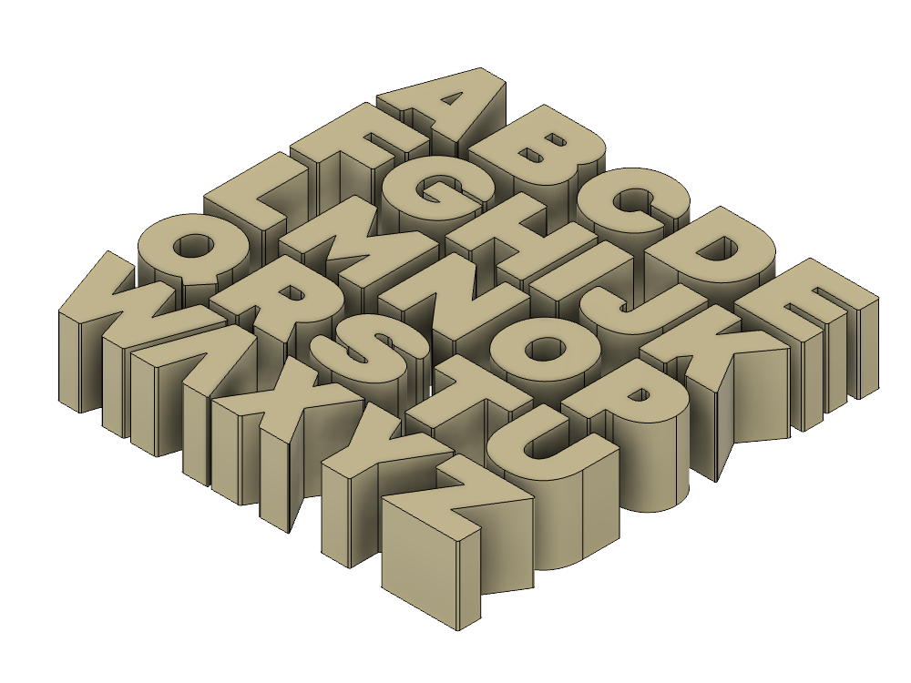

# Alpha Blocks

A set of 1 inch alphabet letter blocks.

> Click the **STL** link to spin the model in GitHub's built-in 3D viewer.

## Model

| | Model | Size | Files |
|---|---|---|---|
|  | **Alpha Blocks** | 26 blocks, each based on a 25.4 mm (1 in) cube Laid out together across 139.8 × 25.4 × 138.2 mm | [STL](print/alpha-blocks.stl) · [3MF](print/alpha-blocks.3mf) [STEP](cad/alpha-blocks.step) · [F3D](cad/alpha-blocks.f3d) |

All 26 letters ship in a single file, arranged in a grid. Separate them in your slicer and print whichever you need — most slicers will split by object automatically, and the STEP carries all 26 as individual solids.

Letters are 1 in cubes at the base, though wider glyphs like **M**, **W** and **V** overhang the cube slightly, and **I** is narrower. Total material for the full set is about 302 cm³.

## Printing

- Mesh is watertight, in millimetres, roughly 67,000 triangles
- The letter faces are flat and the blocks sit on a flat base, so no supports are needed printed face-up

## Source files

- **F3D** — the Fusion model, all 26 letters as separate bodies in one design
- **STEP** — neutral solids, 26 separate bodies

Released under [CC0 1.0](../License.txt) — public domain, no attribution required.
