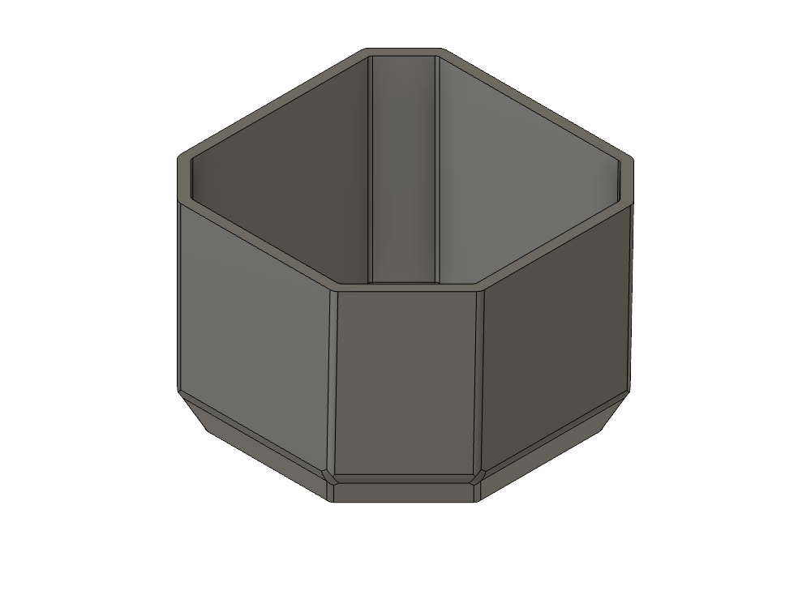
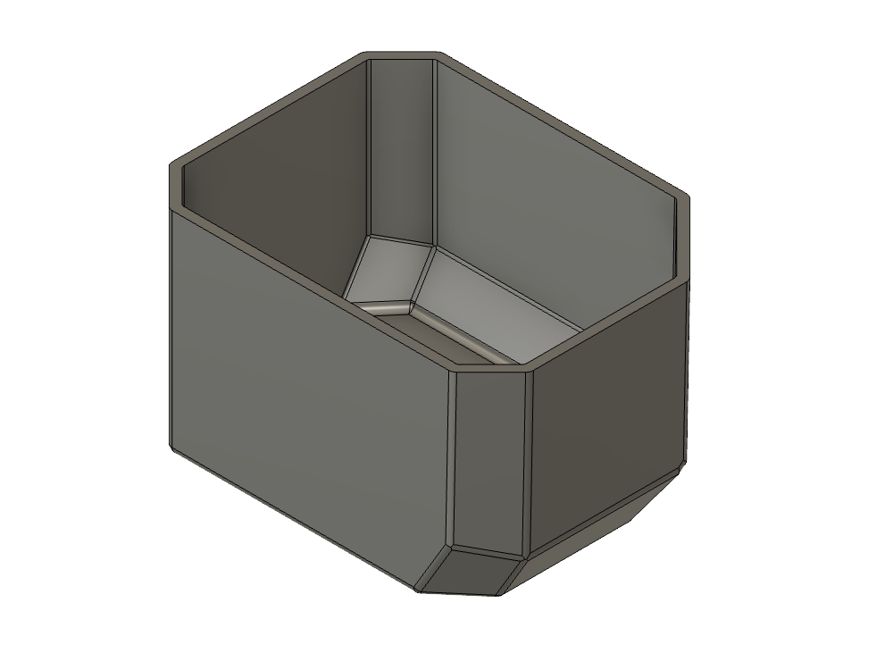
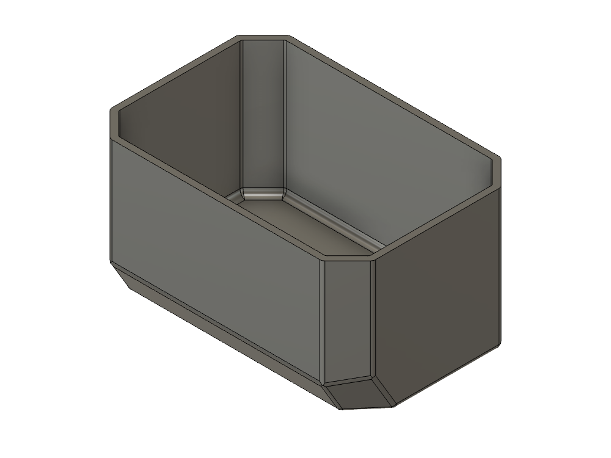

# Packout Inserts

3D printed inserts that subdivide the bins of a Milwaukee Packout tray organizer.

The organizer is 12 × 8 × 1.8 in (305 × 203 × 46 mm) and holds five removable bins — four standard 4 × 4 in bins, plus one wider bin across the middle. These inserts drop into those bins to break them into smaller compartments.

> Click any **STL** link below to spin the model in GitHub's built-in 3D viewer.

## Models

| | Model | Size | Fits | Files |
|---|---|---|---|---|
|  | **Standard Bin Corner** | 43.0 × 42.4 × 34.3 mm 1.69 × 1.67 × 1.35 in | Any corner of a standard 4 × 4 in bin — rotate to suit | [STL](print/standard-bin-corner.stl) · [3MF](print/standard-bin-corner.3mf) [STEP](cad/standard-bin-corner.step) · [F3D](cad/standard-bin-corner.f3d) |
|  | **Wide Bin Corner (UL-LR)** | 58.2 × 43.8 × 34.3 mm 2.29 × 1.73 × 1.35 in | Wide bin — upper-left and lower-right corners | [STL](print/wide-bin-corner-ul-lr.stl) · [3MF](print/wide-bin-corner-ul-lr.3mf) [STEP](cad/wide-bin-corner-ul-lr.step) · [F3D](cad/wide-bin-corner-ul-lr.f3d) |
|  | **Wide Bin Corner (UR-LL)** | 58.2 × 43.8 × 34.3 mm 2.29 × 1.73 × 1.35 in | Wide bin — upper-right and lower-left corners (mirror of the above) | [STL](print/wide-bin-corner-ur-ll.stl) · [3MF](print/wide-bin-corner-ur-ll.3mf) [STEP](cad/wide-bin-corner-ur-ll.step) · [F3D](cad/wide-bin-corner-ur-ll.f3d) |
|  | **Wide Bin Center** | 64.5 × 43.8 × 34.3 mm 2.54 × 1.73 × 1.35 in | Wide bin — middle, two per bin | [STL](print/wide-bin-center.stl) · [3MF](print/wide-bin-center.3mf) [STEP](cad/wide-bin-center.step) · [F3D](cad/wide-bin-center.f3d) |

## Filling the wide bin

Three of the parts tile the wide centre bin together:

- **2 ×  Wide Bin Center** fill the middle, the second rotated 180° — which is why that part is symmetric front to back
- **Wide Bin Corner (UL-LR)** takes the upper-left and lower-right corners, the same part rotated 180°
- **Wide Bin Corner (UR-LL)** is its mirror, covering upper-right and lower-left

**Standard Bin Corner** is for the four 4 × 4 in bins and fits any corner — rotate it so the large chamfer faces the middle of the bin.

## Printing

All four meshes are watertight, with no non-manifold edges.

- **STL** — binary, millimetres, roughly 5,000 triangles each. Mesh volume is within 0.004% of the exact solid.
- **3MF** — units are declared as inches inside the file, which is the design's native unit. Conforming slicers read that and scale automatically; you should not need to rescale anything.
- **Orientation** — print as modelled, open side up with the flat bottom on the bed. The steepest overhang is the front scoop at about 31° from vertical, which is inside the usual unsupported range, so supports shouldn't be needed.
- **Walls** are 1.52 mm (0.06 in), so they print solid at typical line widths without needing infill.

## Source files

- **F3D** — the full parametric Fusion model with its complete feature history. Every dimension is driven by named user parameters (`insert_h`, `base_w`, `depth`, `wall`, `scoop_rise`, `scoop_run`, `draft_ang`, plus the chamfer and fillet radii), so the part can be resized by editing parameters rather than remodelling. There are no move-face or direct-edit features anywhere in the tree.
- **STEP** — neutral solid geometry for any other CAD package. No history.

Released under [CC0 1.0](../License.txt) — public domain, no attribution required.
