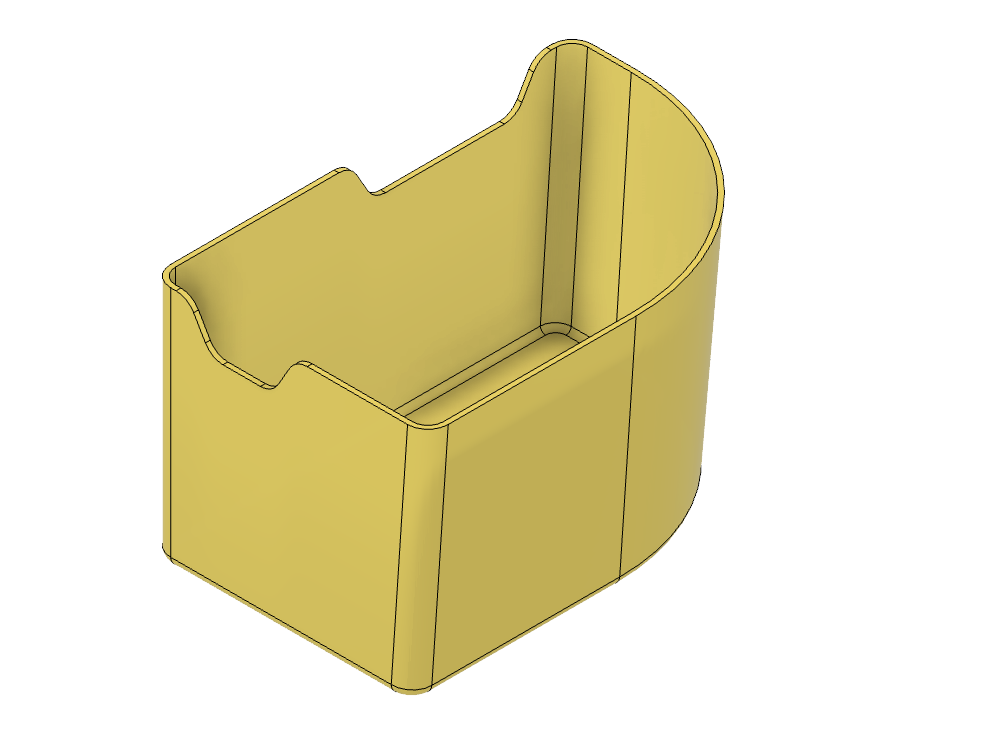
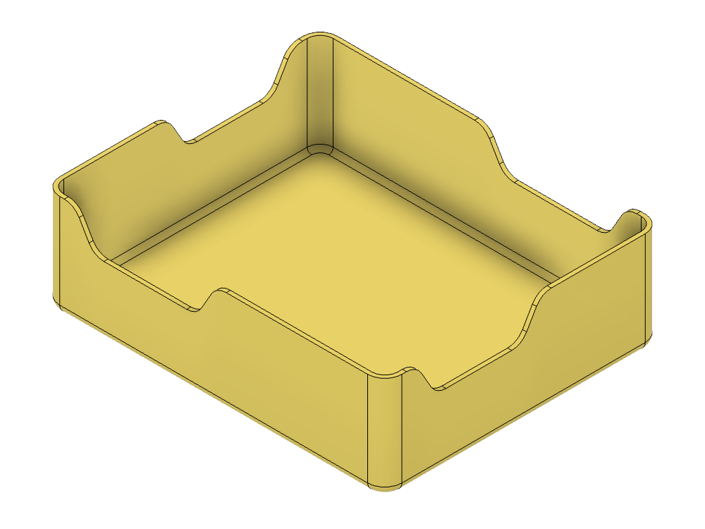
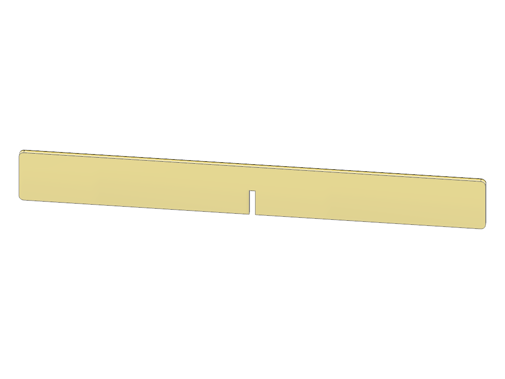

# IKEA — LEGO Bins

Bins and dividers to organize LEGO in IKEA Trofast storage boxes.

> Click any **STL** link to spin the model in GitHub's built-in 3D viewer.

## Models

| | Model | Size | Files |
|---|---|---|---|
|  | **Corner Tray, Left** | 86.8 × 76.2 × 131.9 mm 3.42 × 3.00 × 5.19 in | [STL](print/lego-tray-corner-left.stl) · [3MF](print/lego-tray-corner-left.3mf) [STEP](cad/lego-tray-corner-left.step) · [F3D](cad/lego-tray-corner-left.f3d) |
|  | **Corner Tray, Right** | 86.8 × 76.2 × 131.9 mm 3.42 × 3.00 × 5.19 in | [STL](print/lego-tray-corner-right.stl) · [3MF](print/lego-tray-corner-right.3mf) [STEP](cad/lego-tray-corner-right.step) · [F3D](cad/lego-tray-corner-right.f3d) |
|  | **Middle Tray, Short** | 127.0 × 38.1 × 103.0 mm 5.00 × 1.50 × 4.06 in | [STL](print/lego-tray-middle-short-bin.stl) · [3MF](print/lego-tray-middle-short-bin.3mf) [STEP](cad/lego-tray-middle-short.step) · [F3D](cad/lego-tray-middle-short.f3d) |
|  | **Middle Tray Divider** | 120.8 × 19.1 × 97.5 mm 4.76 × 0.75 × 3.84 in | [STL](print/lego-tray-middle-short-divider.stl) · [3MF](print/lego-tray-middle-short-divider.3mf) [STEP](cad/lego-tray-middle-short.step) · [F3D](cad/lego-tray-middle-short.f3d) |

The corner trays are a **mirror pair** — left and right hand versions of the same shape, not interchangeable.

The middle tray takes **two dividers**. Each divider carries a half-lap slot so the pair cross-slot into each other, splitting the tray into four compartments. Print two of the same file. The STEP and F3D for the middle tray are a single assembly containing the bin and both dividers.

## Printing

All meshes are watertight and in millimetres.

| Model | Material |
|---|---|
| Corner tray (each) | ~56 cm³ |
| Middle tray | ~41 cm³ |
| Divider (×2) | ~4.4 cm³ each |

> **Note:** the previous STL files in this folder were exported in **inches**, so they imported 25.4× undersized in any slicer that assumes millimetres. These replacements are in millimetres and are correct. If you printed from the old files and got something tiny, that's why.

## Source files

- **F3D** — the Fusion models with full feature history
- **STEP** — neutral solids. The middle tray STEP contains three solids: the bin and both dividers.

Released under [CC0 1.0](../License.txt) — public domain, no attribution required.
