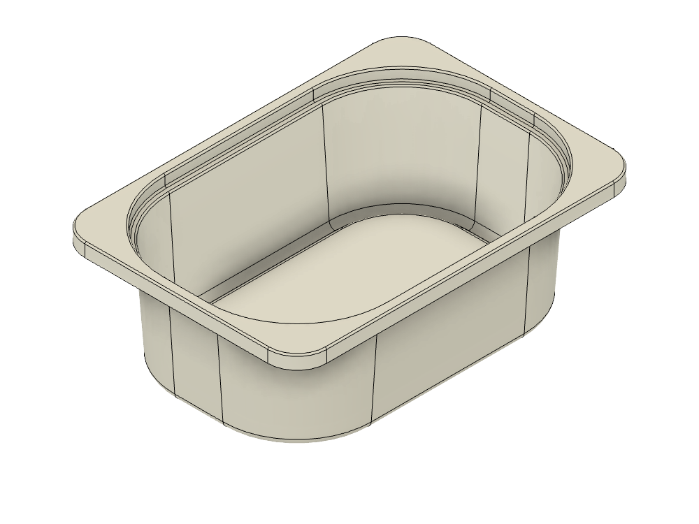

# Trofast Storage Box

Models of IKEA's Trofast storage boxes.

> **These are reference models, not printables.** They exist so you can design things that fit a Trofast box — drop one into your CAD as a reference body and model against it. Printing one would take roughly 300–460 cm³ of material, which is not the point.

> Click any **STL** link to spin the model in GitHub's built-in 3D viewer.

## Models

| | Model | Size | Files |
|---|---|---|---|
|  | **Short Box** | 416.7 × 100.0 × 298.5 mm 16.41 × 3.94 × 11.75 in | [STL](print/trofast-short-bin.stl) · [3MF](print/trofast-short-bin.3mf) [STEP](cad/trofast-short-bin.step) · [F3D](cad/trofast-short-bin.f3d) |
|  | **Half Short Box** | 208.4 × 100.0 × 298.5 mm 8.20 × 3.94 × 11.75 in | [STL](print/trofast-half-short-bin.stl) · [3MF](print/trofast-half-short-bin.3mf) [STEP](cad/trofast-half-short-bin.step) · [F3D](cad/trofast-half-short-bin.f3d) |

The half box is exactly half the width of the short box, so two sit side by side in the same frame opening.

## Using these

For designing inserts, the **STEP** or **F3D** is what you want — real solid geometry you can measure, section and reference. Import it into your CAD package and model your part against the interior faces.

The STL and 3MF are provided for quick visual reference and so the models can be previewed in the browser, not because you should print them.

## Source files

- **F3D** — the Fusion models. These also contain additional reference bodies that are hidden in the design; they are excluded from the mesh and STEP exports.
- **STEP** — a single clean solid per box

Released under [CC0 1.0](../License.txt) — public domain, no attribution required.
