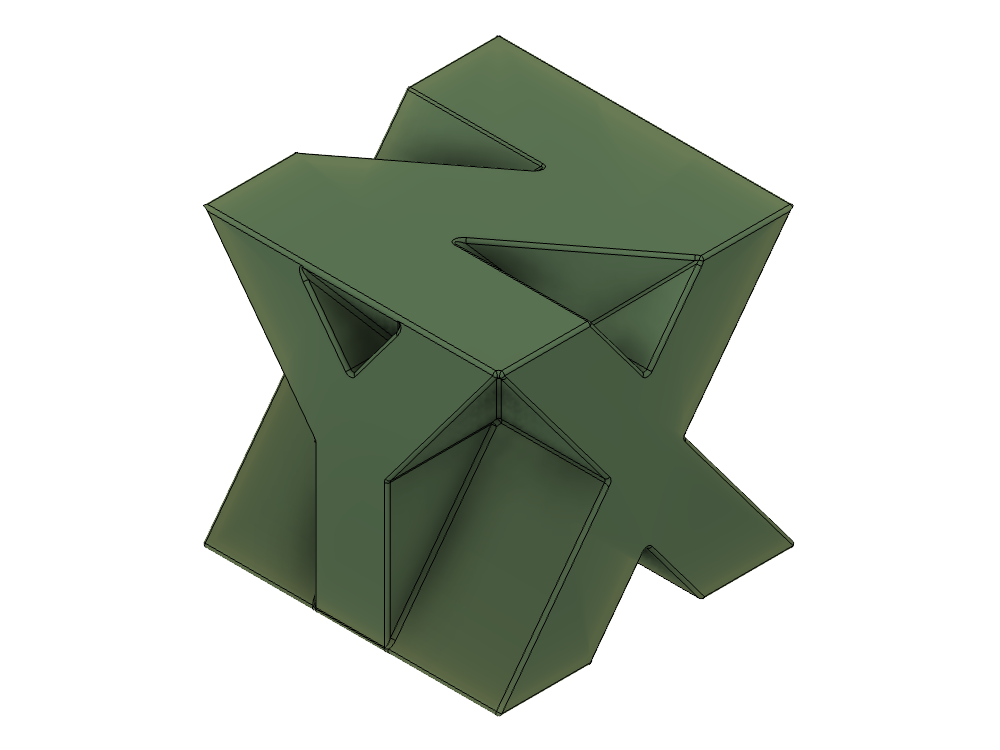

# XYZ Block

A visual reference guide.

Each of the three axes reads as its own letter — X, Y and Z — cut through a 1 inch cube. 

> Click the **STL** link to spin the model in GitHub's built-in 3D viewer.

## Model

| | Model | Size | Files |
|---|---|---|---|
|  | **XYZ Block** | 25.4 × 25.5 × 25.4 mm 1.00 × 1.00 × 1.00 in | [STL](print/xyz-block.stl) · [3MF](print/xyz-block.3mf) [STEP](cad/xyz-block.step) · [F3D](cad/xyz-block.f3d) |

## Printing

- Mesh is watertight, in millimetres, roughly 31,000 triangles
- Material is about 11.5 cm³

**This version contains a fully sealed internal cavity** — I use this space to insert an NFC tag.  To use, add a pause in the print at a layer before the roof closes over. If you just want a solid block, the cavity is small enough to ignore.

## Source files

- **F3D** — the Fusion model with full feature history
- **STEP** — neutral solid. Note it exports as `BREP_WITH_VOIDS` rather than a plain solid, because of the enclosed cavity; that is valid STEP and loads normally.

Released under [CC0 1.0](../License.txt) — public domain, no attribution required.
